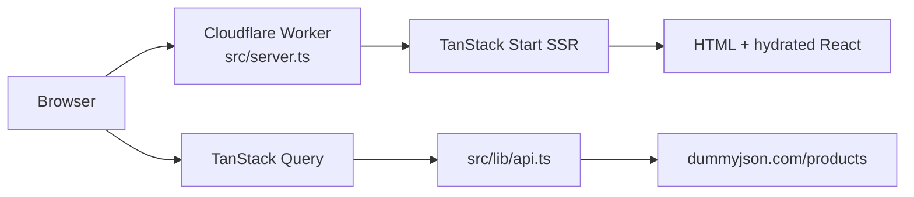

# Atomity PulseGrid AI

A cinematic **Kubernetes cost intelligence** dashboard 
PulseGrid AI visualizes infrastructure activity, detects cloud waste, surfaces optimization insights, and simulates live AI-powered infrastructure monitoring through animated topology graphs, realtime alerts, and dynamic savings projections.

Instead of recreating the reference video literally, I interpreted the “optimization insights” segment as a more immersive AI-native infrastructure intelligence system focused on proactive cost leak detection.

---


## Why I Built This

I chose the optimization insights section from the reference video because it provided an opportunity to transform a static infrastructure dashboard into a more cinematic, realtime product experience.

Modern cloud infrastructure platforms are moving toward:
- proactive optimization
- AI-assisted monitoring
- realtime infrastructure visibility
- predictive cost analysis

Instead of building a traditional dashboard with static KPI cards, I focused on creating an interface that feels operational and continuously active — almost like an AI system actively scanning Kubernetes workloads and surfacing optimization opportunities in realtime.

The goal was to balance:
- product realism
- frontend engineering quality
- motion design
- infrastructure storytelling

without drifting into overly futuristic or gimmicky UI.

---

## Core Features

| Area | Description |
|------|-------------|
| Live Infrastructure Topology | Interactive network graph representing Kubernetes workloads with animated traffic flow, node activity, and scan states |
| AI Optimization Insights | Severity-ranked infrastructure alerts with projected monthly savings and AI-generated recommendations |
| Realtime Monitoring Feel | Infrastructure data refreshes every 5 seconds with dynamic metric updates and synthetic incident generation |
| Savings Intelligence | Animated savings counter derived from active optimization recommendations |
| Confidence Meter | Optimization confidence score visualized with animated radial progress |
| Activity Timeline | Realtime infrastructure events and optimization activity feed |
| Local Persistence | Dismissed alerts and scan history persisted using localStorage |
| Responsive Experience | Optimized layouts for desktop, tablet, and mobile devices |
| Reduced Motion Support | Heavy motion disabled for users with prefers-reduced-motion enabled |

---

## Design Philosophy

The interface was intentionally designed to feel:
- cinematic
- operational
- intelligent
- spatial
- enterprise-focused

rather than:
- overly cyberpunk
- gaming-oriented
- hologram-heavy
- visually chaotic

I wanted the experience to feel closer to products like:
- Linear
- Datadog
- Stripe
- Vercel

where motion guides attention and communicates system activity rather than existing purely for decoration.

The visual system uses:
- layered parallax depth
- subtle glow hierarchy
- glassmorphism
- animated topology visualization
- scan-beam interactions
- realtime metric transitions

to create the illusion of a continuously active AI monitoring platform.

---

## Tech Stack

| Layer | Technology |
|-------|------------|
| Framework | TanStack Start (SSR + routing) |
| UI | React 19 + TypeScript |
| Styling | Tailwind CSS v4 |
| Motion | Framer Motion |
| Data Fetching | TanStack Query |
| Client State | Zustand |
| Persistence | localStorage |
| Deployment | Cloudflare Workers |
| Build Tool | Vite 7 |

---

## Architecture

### Realtime Data Flow

```txt
UI Components
     ↓
TanStack Query
     ↓
Mock API Layer
     ↓
Synthetic Infrastructure Data
     ↓
Zustand Store + localStorage


---

## Quick start

```bash
# Clone and enter the project
cd

# Install dependencies
npm install

# Start dev server (http://localhost:8080)
npm run dev
```

Other scripts:

```bash
npm run build        # Production build (client + SSR worker bundle)
npm run build:dev    # Development mode build
npm run preview      # Preview production build locally
npm run lint         # ESLint
npm run format       # Prettier
```

---

## Project structure

```
atomity-pulsegrid-ai/
├── src/
│   ├── routes/              # TanStack Router pages
│   │   ├── __root.tsx       # HTML shell, meta, QueryClient provider
│   │   └── index.tsx        # Main dashboard (single route)
│   ├── components/          # Feature UI
│   │   ├── NetworkGraph.tsx # Topology SVG + nodes
│   │   ├── InsightCard.tsx  # Alert cards
│   │   ├── SavingsCounter.tsx
│   │   ├── Hero.tsx, Timeline.tsx, …
│   │   └── ui/             
│   ├── hooks/               # React Query wrappers
│   │   ├── useInfraData.ts
│   │   ├── useAlerts.ts
│   │   └── useSavings.ts
│   ├── store/
│   │   └── useAppStore.ts   # Zustand: tick, scans, alerts, persistence
│   ├── lib/
│   │   ├── api.ts           # Data layer (see below)
│   │   ├── storage.ts       # localStorage helpers
│   │   └── queryClient.ts
│   ├── app/api/             # Route handlers (SSR-compatible)
│   │   ├── infra/route.ts
│   │   ├── alerts/route.ts
│   │   └── savings/route.ts
│   ├── types/
│   │   └── infra.ts         # WorkloadNode, Alert, SavingsSnapshot, …
│   ├── tokens/              # colors, spacing, shadows
│   ├── server.ts            # Cloudflare Worker entry (SSR wrapper)
│   ├── start.ts             # TanStack Start middleware
│   └── router.tsx
├── vite.config.ts           # Vite + TanStack Start + Cloudflare plugin
├── wrangler.jsonc           # Worker name, compatibility, entry
├── components.json          # shadcn config
└── package.json
```

Generated at build time: `src/routeTree.gen.ts` (do not edit by hand).

---

## Architecture

### Request flow (production)



1. **SSR:** `src/server.ts` wraps TanStack’s server entry, normalizes catastrophic SSR errors, and serves HTML on Cloudflare.
2. **Hydration:** The client mounts React Router + React Query from `__root.tsx`.
3. **Data:** Hooks poll `getInfra` / `getAlerts` / `getSavings` every 5 seconds, keyed by a `tick` counter in Zustand (bumped on interval and manual rescan).

### Data layer (`src/lib/api.ts`)

There is **no real Kubernetes API** in this demo. The app:

1. Fetches product listings from [DummyJSON](https://dummyjson.com/docs/products) as a stand-in data source.
2. Maps them into **8 workload nodes** with CPU/memory/traffic and health status.
3. Derives **alerts** from underutilized nodes (`cpuUsage < 45`).
4. Aggregates **monthly savings** as the sum of alert `savings` fields.

The files under `src/app/api/*/route.ts` expose the same functions as HTTP GET handlers (e.g. `/api/infra?tick=0`) for SSR or future wiring; the live UI calls `getInfra()` etc. directly from the client via React Query.

### Client state (`src/store/useAppStore.ts`)

| State | Purpose |
|-------|---------|
| `tick` | Invalidates React Query caches on each heartbeat |
| `scanning` | Drives scan beam + nav “Scanning…” indicator (~2.4s) |
| `alerts` | Merged API alerts + synthetic `injectAlert()` entries |
| `dismissedIds` | Persisted dismissals (`pulsegrid:*` keys in localStorage) |
| `savingsHistory` | Points for the timeline component |

Synthetic alerts are injected on an 8-second interval in `index.tsx` to keep the insight column active between API refetches.

---


## Environment variables

Only `VITE_*` variables are injected (see `vite.config.ts`). None are required for local dev; add a `.env` file if you introduce custom endpoints:

```env
# Example (not used by default)
# VITE_API_BASE=https://your-api.example
```

## Troubleshooting

| Issue | Fix |
|-------|-----|
| Engine warnings on Node 20 | Upgrade to Node 22.12+ |
| Empty graph / errors in console | Check network access to `dummyjson.com` |
| Port in use | Change port in `vite.config.ts` or stop the other process on 8080 |
| Stale alerts after refresh | Clear `localStorage` keys prefixed with `pulsegrid:` |

---

## License

Private project (`"private": true` in `package.json`). All rights reserved 
